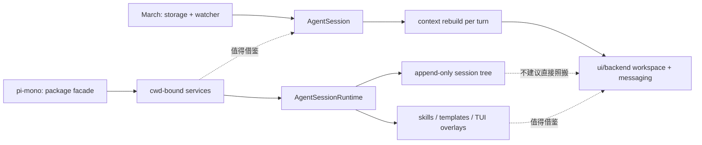

## 问题与范围

这次探索要回答的问题是：`D:\playground\pi-mono` 为什么会让人觉得“用起来顺手”，这种顺手感背后有哪些架构原因；把这些原因和当前 `March-core` 的实现与权威设计对照后，哪些值得借鉴，哪些不该照搬。

本次覆盖范围：

- `pi-mono/packages/agent`、`packages/coding-agent`、相关 docs 中的运行时、会话、扩展与 UI 组织方式
- `March-core` 当前的 `context / watcher / agent session / ui backend / storage` 落地现状
- `easysdd/architecture/DESIGN.md` 中 March 的核心设计原则与实现偏差

本次不展开：

- provider API 细节和模型效果差异
- 具体前端视觉与交互文案
- 任何代码修改或最终拍板

## 速答

`pi-mono` 的顺手感主要来自三件事：第一，它把 “agent 内核 / coding runtime / cwd 绑定服务 / session 持久化 / UI 扩展” 明确拆层，入口少但职责清楚；第二，它把 fork、resume、template、skill、TUI overlay 这类高频操作做成显式能力，而不是埋在内部状态机里；第三，它对扩展能力采用“摘要先暴露、内容按需读取”的渐进式加载，默认心智负担更低。

相比之下，March 的核心设计其实更激进也更先进，尤其是 “文件系统是真实源、上下文每轮重建、前端 snapshot 与 runtime 分层” 这条主线比 `pi-mono` 更强；但当前实现里，`AgentSession`、`ui/backend/messaging.rs`、`ui/backend/workspace.rs` 已经开始承担过多 orchestration 职责，因此 March 现在更需要借的是 `pi-mono` 的运行时边界和能力暴露方式，而不是照搬它的 session tree 持久化模型。

最值得优先优化的方向有三个：

1. 把 “cwd/资源绑定” 与 “session/turn 编排” 从 `AgentSession` 进一步拆开，形成更清晰的 runtime service 层。
2. 把 fork / resume / prompt-template / 可选上下文注入做成更显式的一等能力，减少当前只有内核结构、缺少用户可感知操作面的落差。
3. 在 `ui/backend` 和 turn orchestration 层继续拆分职责，避免 March 的实现优势被“大总管模块”逐步侵蚀。

## 关键证据

### `pi-mono`：运行时先拆服务，再组 session

- `D:\playground\pi-mono\packages\coding-agent\src\core\agent-session-services.ts:17` — runtime 创建把 diagnostics 作为返回值交给上层处理，说明基础设施层不直接绑死 CLI/UI 决策。
- `D:\playground\pi-mono\packages\coding-agent\src\core\agent-session-services.ts:61` — `AgentSessionServices` 把 `cwd`、auth、settings、model registry、resource loader 聚成一层独立的 cwd-bound services。
- `D:\playground\pi-mono\packages\coding-agent\src\core\agent-session-services.ts:129` — `createAgentSessionServices()` 只创建服务，不创建 session，明确切开“环境绑定”和“会话构造”。
- `D:\playground\pi-mono\packages\coding-agent\src\core\agent-session-services.ts:179` — `createAgentSessionFromServices()` 让 model/tools/session options 在目标服务之上再解析，降低切 cwd、resume、fork 时的耦合。

### `pi-mono`：会话切换、fork、导入有统一 runtime 壳层

- `D:\playground\pi-mono\packages\coding-agent\src\core\agent-session-runtime.ts:54` — `AgentSessionRuntime` 明确“拥有当前 session 与其 cwd-bound services”，说明它是生命周期壳层，不是纯数据结构。
- `D:\playground\pi-mono\packages\coding-agent\src\core\agent-session-runtime.ts:118` — `apply()` 统一替换 session/services/diagnostics，避免不同切换路径各自维护状态。
- `D:\playground\pi-mono\packages\coding-agent\src\core\agent-session-runtime.ts:128` — `switchSession()` 走统一的 teardown -> create runtime -> apply 流程。
- `D:\playground\pi-mono\packages\coding-agent\src\core\agent-session-runtime.ts:149` — `newSession()` 也是同一路径，说明新建与恢复不是两套生命周期。
- `D:\playground\pi-mono\packages\coding-agent\src\core\agent-session-runtime.ts:181` — `fork()` 被 runtime 显式建模为一等操作，而不是隐式内部分支。
- `D:\playground\pi-mono\packages\coding-agent\src\core\agent-session-runtime.ts:251` — `importFromJsonl()` 仍复用同一套切换协议，说明操作面统一。

### `pi-mono`：会话树、按需上下文、可组合扩展共同塑造“顺手”

- `D:\playground\pi-mono\packages\coding-agent\src\core\session-manager.ts:315` — `buildSessionContext()` 按 leaf 路径重建会话上下文，说明 session history 是可分支而非线性带状累积。
- `D:\playground\pi-mono\packages\coding-agent\src\core\session-manager.ts:659` — `SessionManager` 明确是 append-only trees，历史不回写，分支只改 leaf。
- `D:\playground\pi-mono\packages\coding-agent\src\core\session-manager.ts:1075` — `getTree()` 暴露防御性拷贝的树结构，支撑 UI 显式导航。
- `D:\playground\pi-mono\packages\coding-agent\src\core\session-manager.ts:1146` — `branchWithSummary()` 把“分支 + 摘要”变成显式原语，降低上下文切换成本。
- `D:\playground\pi-mono\packages\coding-agent\src\core\session-manager.ts:1170` — `createBranchedSession()` 支持把一条路径抽成新 session 文件，说明会话操作不是仅供内部使用。
- `D:\playground\pi-mono\packages\agent\src\agent-loop.ts:247` — `transformContext` 是独立钩子，支持裁剪或注入上下文而不污染核心 loop。
- `D:\playground\pi-mono\packages\agent\src\agent-loop.ts:491` — `beforeToolCall` 作为执行前置关口，说明 tool governance 是架构上的扩展点，不是 UI 逻辑。
- `D:\playground\pi-mono\packages\agent\src\agent-loop.ts:573` — `afterToolCall` 把 tool postprocess 也做成 hook，增强可组合性。

### `March-core`：核心理念更强，但 orchestration 开始聚拢成大模块

- `D:\playground\MA\easysdd\architecture\DESIGN.md:19` — March 的核心理念是“文件系统作为 Source of Truth”和“上下文每轮重建”，这是整个比较的基准。
- `D:\playground\MA\easysdd\architecture\DESIGN.md:68` — 设计文档已经明确写了 `open_files auto_evict`，说明这本来就是目标能力，而不只是可选想法。
- `D:\playground\MA\easysdd\architecture\DESIGN.md:186` — 设计文档已把 turn snapshot / rollback 定义为基础能力，但当前实现尚未明显落地。
- `D:\playground\MA\crates\march-core\src\context.rs:421` — `AgentContextBuilder` 把 open files、notes、skills、recent chat 组装成每轮上下文，符合设计主线。
- `D:\playground\MA\crates\march-core\src\watcher.rs:14` — watcher 的注释直接声明它只维护真实快照，不负责命令执行，体现 truth boundary 清晰。
- `D:\playground\MA\crates\march-core\src\watcher.rs:157` — `watch_file()` 逐文件注册 watch，说明 open_files 的实时性来自专门模块而非临时读取。
- `D:\playground\MA\crates\march-core\src\agent\session.rs:41` — `AgentSession::restore()` 从持久化 task 恢复运行态，是 March 单 task 引擎的核心入口。
- `D:\playground\MA\crates\march-core\src\agent\session.rs:221` — `build_context()` 在 session 上直接构建上下文，说明当前“session + context + runtime”仍然绑定得比较紧。
- `D:\playground\MA\crates\march-core\src\ui\backend\workspace.rs:116` — `workspace_snapshot()` 同时承担快照拼装和运行态 overlay，是当前 UI backend 的核心 façade。
- `D:\playground\MA\crates\march-core\src\ui\backend\messaging.rs:115` — `handle_send_message_with_progress_and_cancel()` 入口同时负责准备上下文、起 turn、合并状态、持久化与发事件，职责密度很高。
- `D:\playground\MA\crates\march-core\src\ui\backend\messaging.rs:951` — `merge_turn_state()` 按 keyed merge 合并 notes/open_files/timeline，说明 March 已经在认真防御粗粒度整对象覆盖。
- `D:\playground\MA\crates\march-core\src\provider.rs:272` — 当前只看到 `context_pressure` 估算与提示，没有看到设计中 `auto_evict` 的真正执行链。

## 细节展开

### March 比 `pi-mono` 更强的地方

March 的优势不是“少做了些功能”，而是它在系统真相边界上更严格。

- `pi-mono` 的 session tree 很适合做分支导航和 compaction，但它的上下文真相仍主要来自消息树重建。
- March 把文件内容、运行态、持久化 task、recent chat 明确分层，并要求每轮都回到磁盘真实状态，这一点在长期 coding 场景里更抗漂移。
- March 的 `merge_turn_state()`、`workspace_snapshot + runtime overlay`、watcher source of truth 这条链条，已经比很多 agent UI 的“大 snapshot 回填”干净得多。

换句话说，March 不需要因为 `pi-mono` 顺手，就回退到“以 session history 为中心”的思路；March 更应该保住自己的 truth model，再补足运行时与能力暴露层。

### 真正值得借的不是 session tree，而是 runtime shell

`pi-mono` 最值得借鉴的不是“会话树”本身，而是它的 runtime 壳层组织：

- 服务先创建，session 后创建。
- new / resume / fork / import 共用一套生命周期。
- diagnostics 先上抛，不在底层直接决定 UI。
- 可选能力先以标准扩展点存在，再由上层决定如何暴露。

对 March 来说，这意味着一个更自然的重构方向：

- 从 `AgentSession` 拆出 `TaskRuntimeServices` 一类的对象，承接 watcher、skills loader、memory manager、shell discovery、provider resolution 等 cwd/task 绑定服务。
- 让 `AgentSession` 更聚焦于 “单 task 的对话状态 + context build + tool loop”。
- 让 `ui/backend/messaging` 只编排 turn，不再同时背负太多 session 恢复和状态保存细节。

### March 现在最该警惕的结构风险

当前最明显的结构风险不是“功能不够”，而是“优势功能开始堆进同一个 orchestrator”。

- `AgentSession` 已经同时拥有恢复、上下文构造、skills、memory、shell discovery、open_files 管理、runtime 估算等职责。
- `ui/backend/messaging.rs` 已经同时处理发送入口、turn worker 生命周期、事件转译、状态 merge、持久化回写。
- `ui/backend/workspace.rs` 已经逐步成为 task snapshot、memory、search、工作区操作的总入口。

如果继续在这些文件上直接叠功能，March 的设计优势会慢慢被实现层面的耦合抵消。

### 建议借鉴顺序

优先级建议如下：

1. **先拆 runtime service 层**
   先解决 `AgentSession` 和 `ui/backend` 的职责聚拢问题，这是后续所有增强的前提。
2. **再补显式操作面**
   把 fork / resume / template / capability injection 做成可见动作，让用户能感知 March 的结构优势。
3. **最后再考虑 session tree 式导航**
   如果未来要做分支会话或显式 fork history，也应建立在 March 现有 task/source-of-truth 模型之上，而不是直接复制 `pi-mono` 的 session JSONL tree。

## 未决问题

- March 是要继续坚持“一个主题一个 task”的主模型，只在 task 内补 fork/branch，还是引入更显式的 session 层？这需要先拍板产品心智模型。
- `open_files auto_evict` 和 `turn snapshot/rollback` 是否要优先于 runtime service 拆分推进？从架构收益看，我倾向于先拆 service 边界，再补这两个能力。
- `pi-mono` 的 prompt template / skill discovery 是否要原样借入 March，还是转译成更符合 March `AGENTS.md + Skills + Notes` 体系的资源层？这需要独立设计。

## 后续建议

- 如果下一步要把这份比较转成可执行方案，建议走 `easysdd-feature-design`，主题可以是“March runtime service layering and explicit session operations”。
- 如果下一步想先控风险，建议先做一个小范围 design spike，只聚焦 `AgentSession` 与 `ui/backend` 的职责拆分，不同时推进功能增强。
- 如果下一步想补长期规范，建议把“什么借、什么不借”沉淀成 `easysdd-decisions`，明确：借 runtime shell、借渐进式能力暴露、不照搬 session tree 作为核心 truth model。

## 相关文档

- `D:\playground\MA\easysdd\architecture\DESIGN.md`
- `D:\playground\MA\easysdd\explores\2026-04-13-march-core-multi-task-implementation.md`
