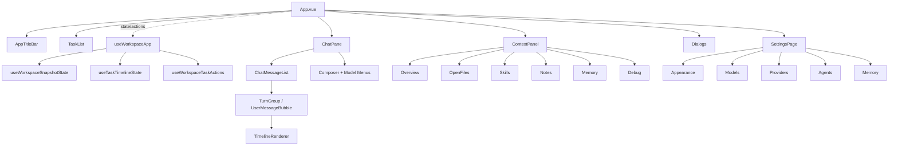

## 问题与范围

这次探索要回答的问题是：March 当前前端如果只保留“能一眼看懂层次”的信息，组件树应该怎么画，哪些组件属于壳层，哪些属于三栏主干，哪些已经下沉到更细的子组件或 composable。

本次只覆盖：

- `src/App.vue` 的页面骨架
- 工作区主视图里的左栏 / 中栏 / 右栏
- 聊天区与设置页的下一层拆分
- `useWorkspaceApp` 及其两个核心状态 composable 在组件树中的位置

本次不展开：

- shadcn/ui 基础 UI 原子组件细节
- 每个 settings section 内部的表单字段
- 样式层、图标层和 Tauri backend API 细节

## 速答

March 前端的层次很清楚，属于典型的“一个壳层 + 三个主面板 + 各自继续向下拆”的结构：

1. `App.vue` 只是总装层，负责把标题栏、任务栏、聊天区、上下文栏、设置页和几个弹窗拼起来。
2. 真正的状态中枢不在组件树里横飞，而是集中在 `useWorkspaceApp()`，它把 snapshot、timeline、task actions、settings、dialogs 统一编排后，再把结果按 `taskListView / chatView / composerView / contextView` 分发给三栏。
3. 中栏 `ChatPane` 是最深的一棵树，继续拆成“消息列表 + composer + 模型菜单”；消息列表再拆成 `TurnGroup / UserMessageBubble`，assistant 文本最终落到 `TimelineRenderer`。
4. 右栏 `ContextPanel` 和设置页 `SettingsPage` 都是明显的“tab/section 壳层”，本身不吞业务细节，而是把不同面板继续下沉成独立 section 组件。

极简版层级图如下：

如果只记一句话，可以记成：

`App 壳层 -> useWorkspaceApp 状态中枢 -> 三栏主组件 -> 各栏 section / message 子组件`

## 关键证据

- `D:\playground\MA\src\App.vue:50`、`:91`、`:127`、`:171`、`:201`、`:215`、`:242` — `App.vue` 模板里直接挂的是 `TaskList`、`ChatPane`、`ContextPanel`、`SettingsPage` 和三个 dialog，说明它是总装层，不是深业务组件。
- `D:\playground\MA\src\App.vue:261`-`271`、`:273` — `App.vue` 统一 import 这些顶层组件，并只创建一个 `useWorkspaceApp()` 实例作为状态入口。
- `D:\playground\MA\src\composables\useWorkspaceApp.ts:84`、`:90`、`:484`-`:487` — `useWorkspaceApp()` 内部先组装 `useWorkspaceSnapshotState` 与 `useTaskTimelineState`，最后只向页面暴露 `taskListView / chatView / composerView / contextView`，说明组件拿到的是分层后的视图模型，不是原始快照。
- `D:\playground\MA\src\components\ChatPane.vue:3`、`:262`、`:283`、`:322`-`:326`、`:414`、`:459` — `ChatPane` 本身再拆成 `ChatMessageList`、模型菜单组件，并由 `useChatComposer()` 和 `useTaskModelSelector()` 处理输入与模型相关状态。
- `D:\playground\MA\src\components\ChatMessageList.vue:18`、`:64`-`:65` — 消息列表按 entry 类型只分流到 `UserMessageBubble` 或 `TurnGroup` 两类节点，是聊天区的渲染分发层。
- `D:\playground\MA\src\components\chat\TurnGroup.vue:40`、`:50`、`:62`、`:121` — assistant turn 内部继续调用 `TimelineRenderer`，所以真正的 assistant 文本/工具时间线渲染已经被压到更下一层。
- `D:\playground\MA\src\components\ContextPanel.vue:67`、`:71`、`:80`、`:88`、`:97`、`:344`-`:348` — `ContextPanel` 只是 tab 容器，实际内容下沉到 `Hints / OpenFiles / Skills / Notes / Memories` 五个 section。
- `D:\playground\MA\src\components\SettingsPage.vue:49`、`:56`、`:101`、`:142`、`:175`、`:197`-`:199`、`:202`-`:206`、`:346`、`:384`、`:413` — 设置页结构是“section 壳层 + 三个 form composable + 五个 section 组件”，说明它不是一个大表单，而是继续按职责分层。

## 细节展开

### 1. 顶层只有两个真正的核心

从结构上看，前端最值得优先记住的不是几十个组件名，而是两个核心：

- `App.vue`：页面骨架和布局容器
- `useWorkspaceApp()`：状态、事件、后端订阅、对话框与 settings 的总编排器

这和 `easysdd/architecture/DESIGN.md` 里“前端运行态和后端 task 事实分层”的思路是一致的。UI 树本身保持薄，状态拼装放在 composable 层。

### 2. 三栏里，聊天区最深

左栏 `TaskList` 很薄，右栏 `ContextPanel` 是 section 容器，而中栏 `ChatPane` 明显是最复杂的区域：

- 一条线处理 timeline 渲染
- 一条线处理 composer
- 一条线处理模型菜单 / 参数菜单 / 工作目录选择

所以如果以后要继续看前端复杂度，优先看聊天区和 `workspaceApp` 相关 composables，而不是先看左右栏。

### 3. 组件层次和状态层次是对齐的

`useWorkspaceSnapshotState` 负责把 workspace snapshot 整理成 `taskListView / composerView / contextView`，`useTaskTimelineState` 负责聊天时间线与 runtime 事件回放；这和三栏 UI 的分区是同构的，而不是“一个大 store 到处塞”。

这意味着当前前端的主层次不是按视觉凑出来的，而是基本和数据流边界一致。

## 未决问题

- `ChatPane` 目前同时承担 composer、模型菜单、工作目录入口和图片附件预览，虽然已经下沉了一部分 composable，但它是否还要继续拆成更独立的 `Composer` 壳层，值得后续单独评估。
- `SettingsPage` 现在已经按 section 和 form composable 拆开，但 provider / model / agent 三块的共享模式是否还能进一步统一，目前这次探索不做判断。

## 后续建议

- 如果下一步只是想快速 onboarding 前端结构，这份图已经够用，可以直接复用。
- 如果下一步要做聊天区或 settings 页的重构，建议接 `easysdd-architecture-check` 或 `easysdd-feature-design`，分别做“现状体检”或“新方案设计”。
- 如果后续经常需要讲解前端结构，可以把这张图再整理进 `easysdd/architecture/ui.md` 的引用链里，但那属于架构文档更新，不是这次 explore 的范围。

## 相关文档

- `D:\playground\MA\easysdd\architecture\DESIGN.md`
- `D:\playground\MA\src\App.vue`
- `D:\playground\MA\src\composables\useWorkspaceApp.ts`
